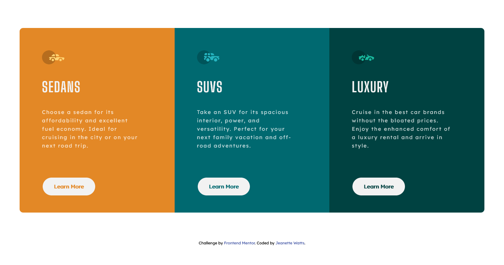

# Frontend Mentor - 3-column preview card component solution

This is a solution to the [3-column preview card component challenge on Frontend Mentor](https://www.frontendmentor.io/challenges/3column-preview-card-component-pH92eAR2-). Frontend Mentor challenges help you improve your coding skills by building realistic projects.

## Table of contents

- [Overview](#overview)
  - [The challenge](#the-challenge)
  - [Screenshot](#screenshot)
  - [Links](#links)
- [My process](#my-process)
  - [Built with](#built-with)
  - [What I learned](#what-i-learned)
  - [Useful resources](#useful-resources)
- [Author](#author)

## Overview

### The challenge

Users should be able to:

- View the optimal layout depending on their device's screen size
- See hover states for interactive elements

### Screenshot

### Links

- Solution URL: [Add solution URL here](https://your-solution-url.com)
- Live Site URL: [Add live site URL here](https://your-live-site-url.com)

## My process

### Built with

- Semantic HTML5 markup
- CSS custom properties
- CSS Grid
- Mobile-first workflow

### What I learned

On this project I learned a bit more about the grid system and how to use the size of the columns to avoid media queries.

I was stuck on the background color of the button on the hover state. I first fiddled with opacity, but that would still require a separate section of css for each card. I discovered the inherit property. A simple property, but one I have never used or really thought about. New little gem for my toolbox. 

### Useful resources

- [Mandy Michael](https://medium.com/@mandy.michael/you-dont-need-a-media-query-for-that-2-responsive-columns-2582c6ea8700)  - This is an amazing article which helped me understand grid column sizes and responsiveness of grids.

## Author

- Website - [Jeanette Watts](https://jeanettew.github.io/FCC-Personal-Portfolio-Page/)
- Frontend Mentor - [@JeanetteW](https://www.frontendmentor.io/profile/JeanetteW)
- Twitter - [@JeanetteE81](https://twitter.com/JeanetteE81)
